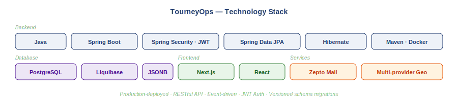

# TourneyOps

**Sports tournament management platform — built for organisers who are done with spreadsheets.**

> A live, Nigerian-owned SaaS platform that replaces the manual coordination behind sports competitions with a single, rules-based system. Currently serving 100+ registered users across 5+ active organisations.

---

## Live Platform

**[tourneyops.com](https://tourneyops.com)** — currently in active iteration based on organiser feedback.

> *This repository is a public showcase for a proprietary platform. Source code is private and will remain so. What is shared here reflects product thinking, engineering maturity, and system design capability — not internal implementation.*

---

## Table of Contents

- [The Problem](#the-problem)
- [The Solution](#the-solution)
- [Who It Serves](#who-it-serves)
- [Key Features](#key-features)
- [System Architecture](#system-architecture)
- [Technology Stack](#technology-stack)
- [Engineering Principles](#engineering-principles)
- [Challenges & Lessons Learned](#challenges--lessons-learned)
- [Business Impact](#business-impact)
- [Roadmap](#roadmap)
- [Screenshots](#screenshots)
- [Contact](#contact)

---

## The Problem

Sports competition management in Nigeria — and across much of Africa — is still largely manual.

Tournament organisers coordinate registrations through Google Forms. Bracket draws happen in WhatsApp groups, often by hand. Scheduling conflicts are discovered the day of the match. Results are recorded in notebooks or Excel sheets. Standings are calculated manually and shared as screenshots.

This creates three compounding problems:

**Subjectivity** — draw decisions, scheduling choices, and eligibility calls are made by individuals, not enforced by rules. This creates disputes and erodes trust in competition outcomes.

**Fragmentation** — registration, scheduling, results, and standings live in different tools with no connection between them. Organisers spend more time coordinating than managing.

**Invisibility** — players have no reliable way to see their own statistics, track their performance history across tournaments, or compare themselves to others over time.

TourneyOps was built to solve all three.

---

## The Solution

TourneyOps gives tournament organisers a single platform to manage the full competition lifecycle — from registration through to final standings — with every decision driven by pre-configured rules rather than manual judgement.

The platform understands the operational logic of multiple competition formats and automates the decisions that previously required manual intervention: who plays whom, in what order, on which venue, with which official, and what happens when a match ends.

**Sport-agnostic by design.** Football and Table Tennis are live. The architecture was deliberately built to support additional sports without structural changes to the platform.

**Nigerian-owned and Nigerian-built.** TourneyOps is designed around how sports organisations in Nigeria and across Africa actually operate — not adapted from a Western product.

---

## Who It Serves

TourneyOps is a multi-stakeholder platform. Six distinct user types interact with the system, each with a different operational context:

| Role | What they do on the platform |
|------|------------------------------|
| **Organiser** | Creates and manages tournaments end-to-end — configuration, registration, scheduling, results, standings |
| **Player** | Registers for tournaments, views their schedule, tracks personal statistics across seasons |
| **Team** | Manages squad roster and participation, views fixtures and standings |
| **Coach** | Monitors team schedule and squad performance |
| **Umpire** | Receives match assignments, submits match events and final scores |
| **Club** | Oversees multiple teams and participants within a sports organisation |

A single user account can hold multiple roles simultaneously — a coach who also plays, or a club administrator who also organises tournaments. The permission model reflects how real users actually operate.

---

## Key Features

### Tournament Management
- Create and configure competitions with flexible parameters: format, sport, participation type, registration rules, and scheduling constraints
- Support for both street (casual) and formal competition structures
- Open and close registration with configurable eligibility enforcement
- Publish competitions and control visibility to participants

### Multiple Competition Formats
The platform supports seven distinct competition formats. Organisers select the format that fits their competition — the platform handles bracket generation, round progression, and edge cases automatically.

Supported formats: League, Knockout, Group-to-Knockout, Challenger Rotation, Double Elimination, Fixed Matches with Bye Recovery, and Gauntlet Staircase.

### Match Operations
- Automated fixture generation based on the selected competition format
- Conflict-aware scheduling that validates all resource constraints before any match is published
- Full match lifecycle management from scheduling through to completion
- Sport-specific event recording for each supported sport

### Participant & Team Management
- Rich player profiles with sport-specific technical attributes
- Team roster management with join requests and invitation flows
- Coach and umpire profiles with certification and assignment tracking

### Venue Management
- Venue registration with location coordinates
- Location-based venue discovery with automatic provider fallback
- Venue availability management and scheduling conflict detection

### Notifications
- Async email and in-app notifications triggered by platform events
- Notification delivery is independent from core business operations — service issues do not affect tournament management

### Statistics & Analytics
- Live standings updated automatically as results are submitted
- Player performance tracked across multiple tournament seasons
- Head-to-head comparisons and multi-phase competition standings

---

## System Architecture

TourneyOps is built as a modular, production-grade platform — a single deployable unit designed for operational reliability, with clean separation between the web application, backend platform, and data layer.

The diagram above shows what the system connects to and how it is deployed. Internal architecture is proprietary and not published here.

**Key architectural characteristics:**

- Stateless JWT-based authentication with role-based access control
- Event-driven async processing — notifications and side effects run independently from core business operations
- Multi-provider external service integration with automatic fallback
- Versioned, auditable schema migrations — no auto-generated DDL in production
- Containerised deployment with environment-variable-driven configuration following 12-factor principles

---

## Technology Stack

| Layer | Technology |
|-------|-----------|
| Backend | Java · Spring Boot · Spring Security · Hibernate/JPA · Maven |
| Database | PostgreSQL · Liquibase |
| Frontend | Next.js · React |
| Auth | JWT · BCrypt |
| Deployment | Docker |
| Email | Zepto Mail |
| Location | Multi-provider geocoding |

---

## Engineering Principles

These are the principles that shaped how TourneyOps was built. Not a description of internal implementation — but the reasoning that guided every significant decision.

**Domain first, code second.**
The most expensive mistakes in any system are structural. Significant time was invested in understanding the real operational domain before any code was written. The domain model went through multiple iterations before the first migration was created.

**Model the real world, not the idealised version.**
Real users are not cleanly one thing. A coach also plays. A club administrator also organises. The permission model was built to reflect this from the beginning.

**Reliability over cleverness.**
Where there was a choice between a clever solution and a correct one, we chose correct. Scheduling, state management, and data migrations all prioritise correctness and auditability over elegance.

**Production systems require pragmatic judgment.**
Software is not finished when it compiles — it is finished when it handles the cases that emerge when real people use it under real conditions. Launching into a live environment with real organiers running real competitions shaped every architectural decision.

**Separation of concerns at every level.**
Business logic, side effects, and infrastructure concerns are deliberately separated. A failure in an external service does not affect a core business operation.

---

## Challenges & Lessons Learned

### Domain complexity precedes code complexity

The hardest part of building TourneyOps was not writing the code — it was understanding the domain well enough to model it correctly. Tournament management has subtleties that only become visible when you work closely with real organisers: edge cases in bracket progression, tiebreaker cascades, what happens when an official cancels on match day.

**Lesson:** Time spent on domain modelling before implementation is not delay — it is the work. A wrong structural decision found late is far more expensive than one caught before the first line of code.

### Scheduling is a constraint satisfaction problem

The conflict-aware scheduling system went through several iterations. An early approach that checked resource availability sequentially had race conditions under concurrent requests. The correct solution required all constraint validation to happen within a single atomic operation.

**Lesson:** Concurrent write scenarios in scheduling systems require careful transaction design from the start. This is not something that can be retrofitted cleanly.

### Role-additive models pay off late

An early design assumed users would hold a single role. This assumption was wrong — real users hold multiple roles simultaneously. The refactor was disruptive mid-development but correct, and would have been far more expensive discovered after deployment.

**Lesson:** Model the real world from the beginning. Assumptions about user behaviour that seem safe early become expensive constraints later.

### Production iteration is part of the build

Launching with real organisers running real competitions created pressure that no amount of planning fully prepares for. Requirements emerged that were only visible once real people used the system under real conditions.

**Lesson:** The gap between a working system and a production system is where most of the real engineering happens.

---

## Business Impact

**For organisers:**
- Bracket draws that previously took hours of manual work now take minutes
- Scheduling conflicts identified automatically before they reach participants
- Results and standings updated in real time — no manual spreadsheet maintenance

**For participants:**
- Single source of truth for all competition information
- Performance statistics tracked automatically across multiple seasons
- Match communications without relying on organiser WhatsApp broadcasts

**Market context:**
Sports tournament management software exists for Western markets. Almost none of it is designed for, priced for, or hosted in the African market. TourneyOps is built around how Nigerian and African sports organisations actually operate.

**Current traction:**
- 100+ registered users
- 5+ active organisations
- 5+ completed tournaments
- Football and Table Tennis fully operational
- Active UX iteration based on organiser feedback

---

## Roadmap

### Near-term
- [ ] Additional sports — Basketball, Badminton, Volleyball
- [ ] Mobile-responsive UX improvements based on current organiser feedback
- [ ] Advanced statistics — player ratings and performance trends
- [ ] Public tournament discovery and registration pages

### Medium-term
- [ ] Mobile application (iOS + Android)
- [ ] Organiser subscription and billing management
- [ ] Live match scoring interface for officials
- [ ] Spectator-facing live standings and fixtures

### Long-term
- [ ] Multi-country expansion beyond Nigeria
- [ ] Third-party API access for sports media and broadcast integration
- [ ] Talent identification — data-driven player profiles for scouts and academies

---

## Screenshots

| Screen | Description |
|--------|-------------|
| **Organiser Dashboard** | Overview of active competitions, upcoming matches, registration activity |
| **Competition Setup** | Format selection, configuration, eligibility rules |
| **Fixture View** | Generated bracket or schedule with match details |
| **Match Detail** | Event recording and live score tracking |
| **Standings** | Real-time standings table |
| **Player Profile** | Sport attributes and cross-season statistics |

*See the live platform at [tourneyops.com](https://tourneyops.com)*

---

## Contact

**Samson Kayode** — Software Engineer & Co-Founder

- **Email:** kayodesamson4@gmail.com
- **LinkedIn:** [linkedin.com/in/kayodesamson](https://linkedin.com/in/kayodesamson)
- **GitHub:** [github.com/samzion](https://github.com/samzion)
- **Platform:** [tourneyops.com](https://tourneyops.com)

Open to backend engineering roles, technical co-founder conversations, and product partnerships.

---

*TourneyOps is co-built with [Emmanuel Kayode](https://github.com/tobi007).*
